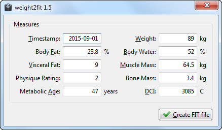

weight2fit
==========
**weight2fit** is a command line tool for generating Flexible and Interoperable Data Transfer (FIT) files.
The input data for the program are values from a scale (weight, body fat percentage, bone mass etc.).
After creation FIT file may be uploaded to sport [Garmin Connect] (https://connect.garmin.com) portal. 

How to Use
----------
To start the program execute from the command line
```
java -jar weight2fit.jar -w (--weight) value [OPTIONAL_PARAMETERS]
```
Here are
```
 -w (--weight) value               : Weight of the body in kg
 -t (--timestamp) yyyy-MM-dd       : Timestamp of measurement 
 -bf (--bodyFat) value             : Fat of the body in %
 -bw (--bodyWater) value           : Water of the body in %
 -vf (--visceralFat) index         : Visceral fat
 -mm (--muscleMass) value          : Muscle mass of the body in kg
 -pr (--physiqueRating) index      : Physique rating
 -bm (--boneMass) value            : Bone mass of the body in kg
 -dci (--dailyCalorieIntake) value : Daily calorie intake in kcal/day
 -ma (--metabolicAge) value        : Metabolic age in years
 -o (--out) FILE                   : Output FIT file name
```
If `timestamp` param is missing current date value will be used. If `out` param is missed `timestamp` value 
will be used as a name of output file.

The detailed params description on Tanita site [here](http://www.tanita.com/en/living-healthy) and [here] (http://www.tanita.com/data/Manuals/HealthyLifeEducationalBro_.pdf) and 
on [Garmin Connect] (https://connect.garmin.com/api/user/style/health/images/health-legends.png).

GUI
---




Building
--------
Regardless of your operating system, you must have the following things installed on it and included in your path:

  * JRE 1.6 or greater
  * Maven 3.x or greater

Open a system shell and check out the sources into some directory. Then `cd` into that directory and type:

`mvn clean package`

The resulting built artifact will be located under the `target` directory.

License
-------
Code is under the [Apache Licence v2](https://www.apache.org/licenses/LICENSE-2.0.txt).

Similar FIT software
--------------------
* [Garmin Forum: Import of Withings wifi scale data now possible...](https://forums.garmin.com/showthread.php?24518-Import-of-Withings-wifi-scale-data-now-possible)
* [scale2fit](http://jmfloreszazo.com/scale2fi)
* [github/fit-weight-scale](https://github.com/marchibbins/fit-weight-scale)
* [Fit File Tools] (http://www.fitfiletools.com)
* [Fit File Repair Tool] (http://fitfilerepairtool.info/)

Useful Links
------------
* [Ant+ FIT SDK](http://www.thisisant.com/resources/fit)
* [Garmin Connect Health Page](http://connect.garmin.com/health)


